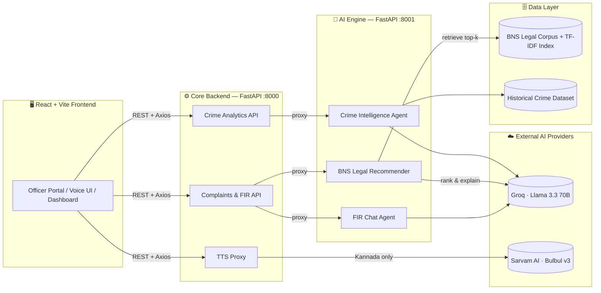

<div align="center">

# 🛡️ KAVACH AI

### Intelligent Policing, Powered by Language.

**An AI-native platform that turns a citizen's spoken complaint into a filed FIR, a legally-grounded case file, and statewide crime intelligence — in the officer's own language.**

[](https://fastapi.tiangolo.com/)
[](https://react.dev/)
[](https://www.typescriptlang.org/)
[](https://groq.com/)
[](https://www.sarvam.ai/)
[](#license)

_Built for Karnataka State Police · Bilingual (English/Kannada) · Decision-support, not decision-making_

</div>

---

## 🚨 The Problem

Filing a First Information Report in India is still, in most stations, a manual, language-bound, paperwork-heavy process:

- A citizen reporting a crime often has to explain it in a language that isn't the officer's first language, or wait for someone who can translate.
- Investigating Officers manually cross-reference the **Bharatiya Nyaya Sanhita, 2023** (India's newly enacted penal code, replacing the IPC) to figure out which sections apply — a corpus most officers haven't fully internalized yet, since it's brand new law.
- Seven different report formats (FIR, Case Diary, Panchnama, Inquest, Seizure Memo, Missing Person, Accident) are drafted from scratch for every case, repeating the same fields.
- Crime pattern intelligence — hotspots, forecasts, anomalies — lives in spreadsheets or nowhere at all, so patrol deployment is reactive, not predictive.

**KAVACH AI** is a full-stack, AI-augmented case-management and crime-intelligence platform that addresses all four — while keeping a human officer in the loop at every legally consequential step.

---

## ✨ What Makes This Different

Most "AI for policing" demos are a chatbot bolted onto a form. KAVACH is built around one hard constraint we took seriously: **every AI output is decision-support, verified by a human, before it becomes an official record.** That shows up everywhere in the product:

- Legal section recommendations are **retrieval-constrained** — the LLM can only cite sections our TF-IDF retriever actually found in the BNS corpus, never sections it recalls from memory. Every recommendation ships with a disclaimer and requires officer sign-off.
- Every generated report (FIR, Panchnama, Inquest, etc.) is **editable and requires an explicit "I have reviewed this for accuracy" checkbox before the PDF unlocks for download.**
- Voice interactions run **entirely in the officer's chosen language** — English via the browser's native speech stack (free, fast), Kannada via **Sarvam AI's Bulbul v3**, because browser-native Kannada TTS/STT support is unreliable across devices.

---

## 🧩 Core Features

### 👮 Officer Portal

- Live case dashboard with status filters (Pending / Under Review / FIR Filed) and real-time stats
- One-click FIR filing with auto-generated FIR numbers
- Full case file view — complainant, victim, incident, evidence, witness details

### 🗣️ Bilingual Voice Case Assistant

- Ask questions about a case by voice or text — applicable law, evidence gaps, next procedural steps
- Full English ⇄ Kannada session support, including a language-gated onboarding flow
- TTS/STT routed intelligently: **English → native Web Speech API**, **Kannada → Sarvam Bulbul v3**, so voice quality never degrades in the officer's preferred language

### ⚖️ BNS Legal Section Recommender

- TF-IDF + cosine-similarity retrieval over the full **Bharatiya Nyaya Sanhita, 2023** corpus, feeding only the top candidates to an LLM
- Groq-hosted **Llama 3.3 70B** ranks and explains — never invents — applicable sections, with cognizability, bailability, and punishment metadata pulled straight from the statute
- Officers can run this against an existing case or paste free-form incident text for quick lookups

### 📄 Multi-Format Report Generator

- Seven Karnataka State Police report formats (FIR, Case Diary, Panchnama, Inquest, Seizure Memo, Missing Person Report, Accident Report) auto-populated from case data
- Section-by-section review and editing, locked behind an explicit approval gate
- Client-side PDF export with letterhead, officer signature block, and pagination — no server round-trip needed post-approval

### 🗺️ Crime Intelligence Dashboard

- Statewide KPI overview — FIRs, districts, stations, high-risk zones
- Organic density heatmap (Leaflet + `leaflet.heat`) with fly-to zoom on station selection
- **7-day crime forecasting**, **temporal pattern detection**, and **statistical anomaly alerts** (spikes/drops vs. baseline) per station
- An **AI Intelligence Copilot** that turns raw analytics into a plain-language operational narrative and a full Groq-generated situational report

---

## 🏗️ Architecture

KAVACH runs as three independently deployable services, so the case-management backend, the analytics backend, and the AI/LLM engine can scale and fail independently.



### Why this split?

- **Core Backend (`:8000`)** owns complaints, FIR lifecycle, and analytics data — the system of record.
- **AI Engine (`:8001`)** owns every LLM/agent call, isolated so a Groq outage or model swap never touches case data.
- **Sarvam** is called _only_ when `language == "kn"` — English speech stays free and fast on the browser's native stack.

---

## 🛠️ Tech Stack

| Layer               | Technology                                               |
| ------------------- | -------------------------------------------------------- |
| **Frontend**        | React + TypeScript, Vite, React Router, Axios            |
| **Maps & Viz**      | React-Leaflet, `leaflet.heat`, Lucide Icons              |
| **PDF Generation**  | jsPDF (fully client-side, post-approval)                 |
| **Core Backend**    | FastAPI, Pydantic, httpx                                 |
| **AI Engine**       | FastAPI, Groq SDK (Llama 3.3 70B)                        |
| **Legal Retrieval** | scikit-learn (`TfidfVectorizer`, cosine similarity)      |
| **Voice (Kannada)** | Sarvam AI — Bulbul v3 TTS                                |
| **Voice (English)** | Web Speech API (`SpeechSynthesis` / `SpeechRecognition`) |
| **State**           | Zustand (`authStore`)                                    |

---

## 🚀 Getting Started

KAVACH is three services. Run all three for the full experience.

### 1. Frontend

```bash
cd frontend
npm install
npm run dev          # http://localhost:5173
```

### 2. Core Backend

```bash
cd backend
pip install -r requirements.txt --break-system-packages
uvicorn app.main:app --reload --port 8000
```

### 3. AI Engine

```bash
cd ai
pip install -r requirements.txt --break-system-packages
uvicorn main:app --reload --port 8001
```

### Environment Variables

Create a `.env` in the **AI Engine** directory:

```env
GROQ_API_KEY=your_groq_key_here
SARVAM_API_KEY=your_sarvam_key_here
```

> ⚠️ Both backend services must be running simultaneously — the Core Backend proxies every AI-dependent request (`/fir/chat`, `/legal/recommend`, `/fir/tts`, `/pattern-summary/...`) to the AI Engine over `localhost:8001`.

---

## 📡 Key API Surface

| Method  | Endpoint                            | Purpose                                   |
| ------- | ----------------------------------- | ----------------------------------------- |
| `POST`  | `/api/v1/auth/login`                | Officer/citizen authentication            |
| `POST`  | `/api/v1/complaints/submit`         | File a new citizen complaint              |
| `PATCH` | `/api/v1/complaints/{id}/file-fir`  | Officially convert complaint → FIR        |
| `POST`  | `/api/v1/fir/chat`                  | Conversational case assistant (bilingual) |
| `POST`  | `/api/v1/fir/tts`                   | Kannada text-to-speech via Sarvam         |
| `POST`  | `/api/v1/legal/recommend`           | BNS section recommendations               |
| `GET`   | `/api/v1/dashboard`                 | Statewide crime KPIs                      |
| `GET`   | `/api/v1/hotspots`                  | Geo-tagged crime hotspots                 |
| `GET`   | `/api/v1/forecast/{station}`        | 7-day predictive risk                     |
| `GET`   | `/api/v1/patterns/{station}`        | Temporal crime patterns                   |
| `GET`   | `/api/v1/anomalies/{station}`       | Statistical spike/drop detection          |
| `POST`  | `/api/v1/pattern-summary/{station}` | Plain-language AI narrative               |

---

## 🔐 Responsible AI, by Design

This isn't an afterthought section — it shaped the architecture:

- **No section is ever recommended from LLM memory.** The legal recommender validates every model output against the actual retrieval set before it reaches the officer.
- **No report leaves the system without human approval.** Every generated document is editable and gated behind an explicit confirmation before PDF export unlocks.
- **Every AI panel is labeled as decision-support**, with an explicit "Officer verification required" disclaimer surfaced in the UI, not buried in a terms page.

---

## 🗺️ Roadmap

- [ ] Multi-officer FIR approval workflow (co-signing for serious offences)
- [ ] Offline-first PWA mode for low-connectivity stations
- [ ] Additional regional languages beyond Kannada (Sarvam supports 10+ Indian languages)
- [ ] Cross-station case linking for repeat-offender pattern detection

---

<div align="center">

**Built with ⚖️ and ☕ for the officers who keep the shift together.**

_KAVACH — ಕವಚ — "Shield"_

</div>
